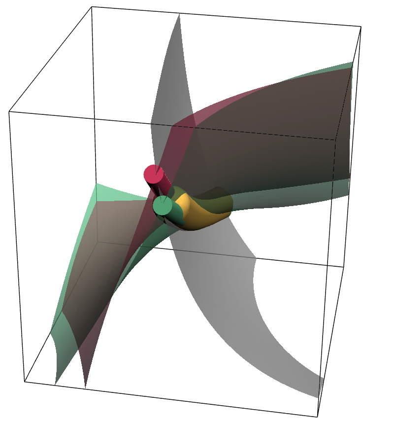

# Random Crosslinked Random-Wave Line Networks

This folder contains a PyVista/NumPy workflow for generating three real
random-wave scalar fields in a periodic cubic box and visualizing two retained
pairwise zero-line families:

- `Gamma_12`: points where `phi_1 = 0` and `phi_2 = 0`
- `Gamma_13`: points where `phi_1 = 0` and `phi_3 = 0`

The third pair, `Gamma_23`, is not rendered. Crosslink nodes are estimated where
the retained `(1,2)` and `(1,3)` vortex-line traces meet, corresponding to
triple-zero points `phi_1 = phi_2 = phi_3 = 0`.



In the retained network, the red `Gamma_12` and green `Gamma_13` line families
share the `phi_1 = 0` surface. Where `phi_2` and `phi_3` vanish at the same
location on that surface, a triple-zero point acts as a crosslink between the
two line families. Since `Gamma_23` is omitted, each generic retained crosslink
has the local topology of two crossing line families rather than a third
rendered branch.

## Files

- `rw_line_network.py`: reusable script with field generation,
  k-vector sampling, vortex-line tracing, smoothing, crosslink detection, and
  PyVista rendering.
- `rw_line_scattering.py`: scattering utilities for traced line networks,
  including point and line-segment amplitudes, smooth-window corrections,
  seed-averaged scattering, and single-chain helper functions.
- `interactive_rw_line_network.ipynb`: notebook interface for tuning
  sampling, tracing, crosslink, and render settings.
- `interactive_rw_line_scattering.ipynb`: full retained-network scattering
  notebook.
- `interactive_rw_single_chain_scattering.ipynb`: one-field/single-chain
  scattering notebook for the `Gamma_12` family, with a Gaussian random-wave
  reference.
- `interactive_rw_single_chain_necklace_scattering.ipynb`: bead-necklace
  single-chain scattering notebook comparing traced point beads, traced
  continuous segments, and a Gaussian continuous curve post-processed by the
  curvature-damped necklace modulation.
- `interactive_rw_cxl_chain_scattering.ipynb`: two-family three-wave
  crosslinked-chain scattering notebook for `Gamma_12 + Gamma_13`, with
  tunable `phi_2`/`phi_3` correlation and a four-field Gaussian reference.
- `smpl/`: compact line-scattering notebooks and Python helpers for analytic
  and conditional-sampling experiments, including monochromatic, general
  wave-number, and four-field line cases.
- `figure_coupling/`: coupling sweep figures and the settings used to generate
  them.
- `schematic.ipynb`: notebook used to generate the schematic figures.
- `schematic_cxl.png`: schematic explaining the retained crosslink mechanism.
- `schematic_nocxl.png`: companion schematic without the crosslink highlight.
- `schematic_crosslink.png`: combined schematic crosslink visualization.

## Main Controls

The notebook organizes settings into three groups.

### Sampling settings

The fields are sampled on a cubic grid with normalized block coordinates
`r_tilde = (x/N, y/N, z/N)`, so one block side is effectively `L = 1`.

Important controls:

- `GRID_SIZE`: number of grid points along each direction in one sampled block.
- `NUM_BLOCK`: number of blocks per direction. `NUM_BLOCK = 1` uses the
  original single-box method; `NUM_BLOCK = 2` stitches a `2 by 2 by 2`
  expansion.
- `BLOCK_OVERLAP`: number of extra grid points evaluated around each block
  before cropping back to the block core.
- `RANDOM_SEED`: reproducible random seed.
- `NUM_MODES`: number of random-wave modes for `(phi_1, phi_2, phi_3)`.
- `K_DISTRIBUTION`: one of `single_shell`, `gaussian_radial`, `uniform_band`,
  or `user_list`.
- `K0`: per-field central wave number, in units of `k*L`.
- `r_SIGMA_K`, `r_K_MIN`, `r_K_MAX`: relative width and band limits, multiplied
  by each field's `K0`.
- `SHARED_K_VECTORS`: whether fields share sampled k-vectors.

For block-wise assembly, the recombined grid has side length
`(GRID_SIZE - 1)*NUM_BLOCK + 1`. The same random-wave coefficients are reused in
every block. Field normalization is estimated from the mode amplitudes
(`sum(A_n^2)/2`) rather than fitted from the sampled grid, so changing
`NUM_BLOCK` does not silently rescale the fields. Vortex and crosslink detection
are then performed on the recombined grid.

### Coupling phi_2 and phi_3

The script can tune the expected overlap of the two retained line families by
constructing `phi_2` and `phi_3` from two independent base random waves:

```python
phi_2 = (Sa + c*Sb) / sqrt(1 + c**2)
phi_3 = (Sa - c*Sb) / sqrt(1 + c**2)
```

Enable with:

```python
COUPLE_PHI2_PHI3 = True
PHI23_COUPLING_C = c
```

For iid Gaussian-like base waves, the expected pointwise correlation is:

```python
corr(phi_2, phi_3) = (1 - c**2) / (1 + c**2)
```

Thus `c = 0` makes `phi_2` and `phi_3` identical, while `c = 1` gives zero
correlation and behaves as independent in the Gaussian random-wave limit.

### Line tracing settings

When `USE_VORTEX_TRACING = True`, the code traces the zero lines using phase
winding of the complex fields:

```python
psi_12 = phi_1 + 1j*phi_2
psi_13 = phi_1 + 1j*phi_3
```

The raw phase-winding line segments are traced first. Crosslink candidates are
identified on the raw traces, then the displayed lines are smoothed and the
crosslink centers can be adjusted to the closest pair of smoothed segments.

Useful controls:

- `SMOOTH_VORTEX_LINES`: enable spline smoothing of traced lines.
- `VORTEX_FACE_PREFILTER`: compute phase winding only on faces where both
  scalar fields can plausibly cross zero.
- `VORTEX_FACE_ZERO_TOL`: relaxed zero-bracketing tolerance for the prefilter;
  larger values are safer for near-tangent cases but admit more faces.
- `VORTEX_SMOOTHING_SCALE`: interpolation density along smoothed lines.
- `VORTEX_TUBE_RADIUS`: rendered tube radius, in grid-coordinate units.
- `CROSSLINK_SEARCH_RADIUS`: distance used to find raw contacts between the
  retained line families.
- `CROSSLINK_MERGE_RADIUS`: distance below which candidate crosslinks are merged.
- `CROSSLINK_ADJUST_TO_SMOOTHED_LINES`: move detected nodes onto the smoothed
  line geometry.
- `CROSSLINK_BALL_RADIUS`: rendered crosslink sphere radius, in grid-coordinate
  units.

### Render settings

The notebook exposes controls for PyVista window size, camera zoom, bounding-box
visibility, surface colors/opacities, tube colors/opacities, and optional mesh
edge display on surfaces and tubes.

## Scattering Workflows

`rw_line_scattering.py` evaluates orientationally averaged line scattering from
the traced geometry. Two amplitude methods are available:

- `SCATTERING_AMPLITUDE_METHOD = "line_segments"`: integrates each traced
  segment analytically and is the preferred continuous-line calculation for
  high-`Q` asymptote checks.
- `SCATTERING_AMPLITUDE_METHOD = "points"`: samples lines as zero-volume bead
  scatterers. This is useful for visualization and debugging, but at
  sufficiently high `Q` it develops a point self-term floor controlled by
  `LINE_SAMPLE_SPACING`.
- `SCATTERING_AMPLITUDE_METHOD = "balls"`: uses the same bead centers and
  integrated bead scattering lengths as `"points"`, but multiplies each bead
  amplitude by the normalized uniform-sphere form factor. With
  `POINT_WEIGHT_MODE = "arclength"`, each bead carries `B=lambda*b`; the
  sphere volume SLD is therefore `B/V_bead`.

Useful scattering controls:

- `SCATTERING_WINDOW = "none" | "tukey_box" | "hann_box" | "gaussian"` applies
  a smooth observation window to the line geometry.
- `SUBTRACT_WINDOWED_MEAN` subtracts the smooth mean-density amplitude
  associated with the selected window.
- `INTENSITY_NORMALIZATION = "none" | "i0" | "length_density"` controls the
  normalization applied inside the scattering routine.
- `POINT_WEIGHT_MODE = "unit" | "arclength"` controls point-sample weights when
  using the point amplitude method. `"unit"` preserves equal bead weights;
  `"arclength"` assigns each sampled line point
  `LINE_SAMPLE_SPACING * family_weight`.
- `SCATTERING_Q_CHUNK_SIZE` controls progress chunks for long notebook runs; it
  does not change the scattering formula.

The single-chain notebook uses `Gamma_12` only and plots reduced units designed
to compare a finite traced line with the Gaussian random-wave reference:

```python
I(Q) = I_raw(Q) / int W(r)^2 dV
d = sum(ds * W(r)^2) / int W(r)^2 dV
left_y = I(Q) / d^2
left_guide = pi / (Q*d)
right_y = left_y / left_guide
```

The x axis is labeled `Q/k`, where
`k = 2*pi*<k_cycles>/GRID_SIZE` in grid-coordinate units. The theoretical
monochromatic density `k^2/(3*pi)` is printed as a reference, while the reduced
plot uses the window-squared density sampled by the traced line geometry.

The necklace notebook uses the same reduced units, but deliberately increases
`LINE_SAMPLE_SPACING = b` and treats point samples as finite beads with
`POINT_WEIGHT_MODE = "arclength"`. The easiest control is the dimensionless
spacing `beta=b*k`, converted to physical notebook settings by
`rw_line_scattering.bead_necklace_parameters_from_beta(...)`. The Gaussian
continuous curve can be post-processed with:

```python
beta = b*k
L_c = sqrt(15/8) / k
I_neck(Q) = I_cont(Q) * M(Q/k, beta) * P_sphere(Q)
```

where `M` is the normalized curvature-damped necklace modulation implemented in
`rw_line_scattering.necklace_modulation(...)`. The default bead diameter equals
the spacing `b`, and `P_sphere(Q)` is the normalized spherical bead form factor
squared. The normalized form preserves `M(0)=P_sphere(0)=1`, so the average
arclength SLD is unchanged when each bead carries scattering length
`B=lambda*b`.

The CXL-chain notebook keeps both retained families, `Gamma_12` and
`Gamma_13`, in a three-wave system. The default `PHI23_CORRELATION_RHO = 0`
demonstrates independent `phi_1`, `phi_2`, and `phi_3`; changing that parameter
tunes the correlation between `phi_2` and `phi_3`. In the four-field Gaussian
comparison this maps to:

```python
rho13 = 1                       # shared phi_1 between Gamma_12 and Gamma_13
rho24 = PHI23_CORRELATION_RHO   # tunable phi_2/phi_3 correlation
```

The total comparison follows the `smpl/rw_4field_line_demo.ipynb` convention:
`I_total = I_AA + I_BB + 2*I_AB`.

## Running

Use the `pyvista` conda environment:

```powershell
conda activate pyvista
cd C:\Users\ccu\Documents\codex_projects\project_randomcxl
python rw_line_network.py
```

For interactive exploration, open `interactive_rw_line_network.ipynb`
with the same environment selected as the notebook kernel.

## Coupling Sweep

The `figure_coupling/` folder contains a sweep over `PHI23_COUPLING_C`. Each
image uses the same notebook settings except for the coupling value. The
associated `settings.txt` records the expected correlation and detected
crosslink counts for each figure.
